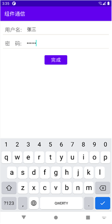

# NewContacts
设计一个主Activity和一个子Activity（Sub-Activity），使用主Activity上的按钮启动子Activity，并将子Activity的一些信息返回给主Activity，并显示在主Activity上，可以自己设计界面和场景，。主Activity界面上有一个“登录”按钮和一个用了显示信息的TextView，点击“登录”按钮后打开一个新的Activity，新Activity上面有输入用户名和密码的控件，在用户关闭这个Activity后，将用户输入的用户名和密码传递到主Activity，并显示在主Activity的TextView中。

